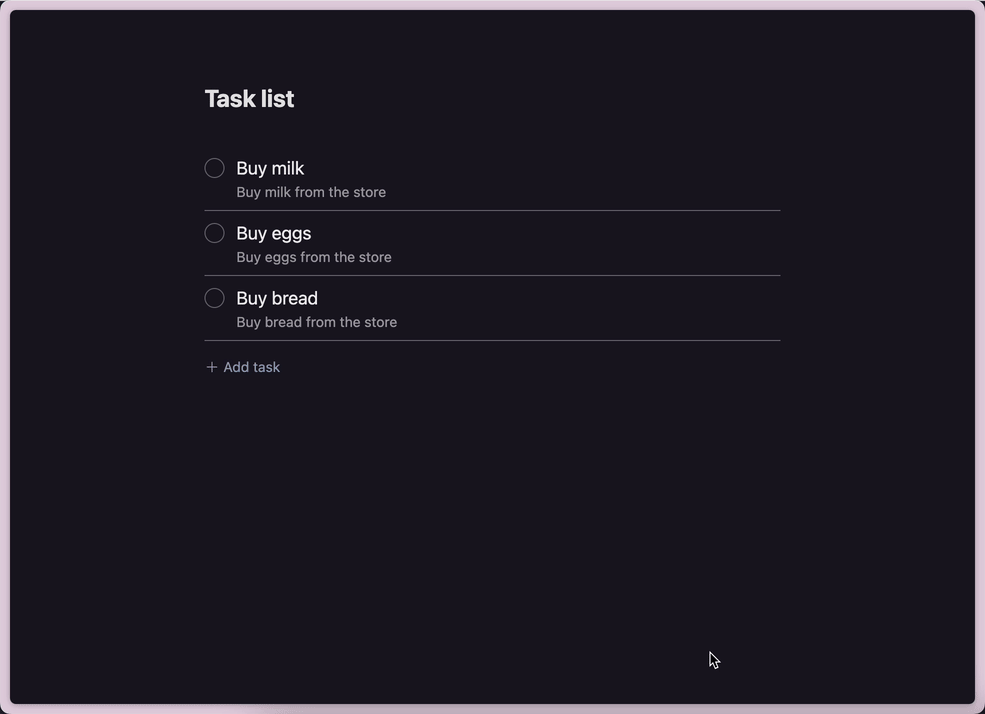

# End-to-end type-safe Todo App on Cloudflare

This Todo App is a project demonstrating the creation of an end-to-end type-safe web application quickly and cost-effectively by combining tRPC, Drizzle, Cloudflare Pages, Cloudflare Pages Functions, and Cloudflare D1.



# Key Features

- Host static content built by [Vite](https://vitejs.dev/) on Cloudflare Pages
- Implement serverless functions for API endpoints using [Cloudflare Pages Functions](https://developers.cloudflare.com/pages/platform/functions/)
- Utilize [tRPC](https://trpc.io/) for type-safe communication between backend and frontend
- Use [Cloudflare D1](https://developers.cloudflare.com/d1/) as a lightweight, SQLite-based database solution
- Use [Drizzle](https://github.com/drizzle-team/drizzle-orm) as a ORM and migration generator

# Prerequisites

- Node.js (v18 or higher)
- Cloudflare account

# Getting Started

1. Create a repository from this template repository using the GitHub CLI

   ```bash
   gh repo create todo-demo --clone --public --template toyamarinyon/trpc-d1-todo
   cd todo-demo
   ```

1. Instal dependencies

   ```bash
   npm install
   ```

   > **Note** I prefer pnpm over npm but Cloudflare Pages builds do not yet support pnpm.

1. Expose your database name

   Replace `<DATABASE_NAME>` to your database name. It will be use by following steps.

   ```bash
   DEMO_DATABASE_NAME=<DATABASE_NAME>
   ```

1. Create your database

   Run the following command and give your database a name:

   ```bash
   npx wrangler d1 create $DEMO_DATABASE_NAME
   ```

1. Configure database binding with wrangler.toml

   You need to configure database binding to run it and test it locally with wrangler.toml

   Add the following to your wrangler.toml file:

   ```toml
   [[ d1_databases ]]
   binding = "<BINDING_NAME>"
   database_name = "<DATABASE_NAME>"
   database_id = "<UUID>"
   ```

   Set your binding name by updating the <BINDING_NAME> value. Your binding is available in your Cloudflare Pages Functions at env.<BINDING_NAME>. You will find the values for database_name and database_id in your terminal after you run the create command in step 4.

1. Create table against your local database

   Cloudflare D1 provides migration tools. You can use it to check list of unapplied migrations:

   ```bash
   npx wrangler d1 migrations list $DEMO_DATABASE_NAME --local
   ```

   Then you can see the following:

   ```bash
   ┌────────────────────────────┐
   │ Name                       │
   ├────────────────────────────┤
   │ 0000_dusty_dragon_lord.sql │
   └────────────────────────────┘
   ```

   This migration creates a `tasks` table and inserts three tasks.

   ```bash
   $ cat migrations/0000_dusty_dragon_lord.sql

   CREATE TABLE tasks (
           `id` integer PRIMARY KEY NOT NULL,
           `title` text NOT NULL,
           `description` text NOT NULL,
           `completion_at` integer
   );

   INSERT INTO tasks (title, description)
   VALUES ('Buy milk', 'Buy milk from the store'),
          ('Buy eggs', 'Buy eggs from the store'),
          ('Buy bread', 'Buy bread from the store');
   ```

   And you can use the following to apply any unapplied migrations:

   ```bash
   npx wrangler d1 migrations apply $DEMO_DATABASE_NAME --local
   ```

   Then validate your data is in your database by running:

   ```bash
   npx wrangler d1 execute $DEMO_DATABASE_NAME --local --command='SELECT * FROM tasks'
   ```

   You'll see the following:

   ```bash
   ┌────┬───────────┬──────────────────────────┬───────────────┐
   │ id │ title     │ description              │ completion_at │
   ├────┼───────────┼──────────────────────────┼───────────────┤
   │ 1  │ Buy milk  │ Buy milk from the store  │               │
   ├────┼───────────┼──────────────────────────┼───────────────┤
   │ 2  │ Buy eggs  │ Buy eggs from the store  │               │
   ├────┼───────────┼──────────────────────────┼───────────────┤
   │ 3  │ Buy bread │ Buy bread from the store │               │
   └────┴───────────┴──────────────────────────┴───────────────┘
   ```

   This completes the creation of the local database. Now let's run the ToDo application locally.

1. Run locally with Wrangler

   To run Cloudflare Pages locally, use the `wrangler pages dev` command; to run Cloudflare D1 as well, add the three options `--local`, `--persist`, and `--d1=<DATABASE_NAME>`.

   Then add `npm run dev` to the end of the command to integrate Cloudflare Pages and Vite's dev server.

   ```bash
   npx wrangler pages dev --local --persist --d1=$DEMO_DATABASE_NAME -- npm run dev
   ```

   This will then start serving your Pages project. You can press B to open the browser on your local site :tada:

# Deploying to Cloudflare Pages and Cloudflare Pages Functions

1. Log in to the Cloudflare dashboard.
1. Select your account in **Account Home** > **Pages**.
1. Select **Create a project** > **Connect to Git**.
1. Select your new GitHub repository.
1. In the **Set up builds and deployments**, set `npm run build` as the **Build command**, and `dist` as the **Build output directory**.
1. Select **Environment variables (advanced)** > **+ Add variable** > configure a `NODE_VERSION` variable with `17`.
1. The deployment will succeed, but database binding is not yet, so setting it is.

   1. Show **Settings** tab.
   1. Select **Functions** menu.
   1. Select **D1 database bindings** > **Add binding** > configure a `DB` variable with a value of `<DATABASE_NAME>`

1. Redeploy the latest deployment to apply the above settings.
1. Migrate the D1 database on Cloudflare

   Show unapplied migrations as list:

   ```bash
   npx wrangler d1 migrations list $DEMO_DATABASE_NAME
   ```

   Then apply them:

   ```bash
   npx wrangler d1 migrations apply $DEMO_DATABASE_NAME
   ```

   Open the page, you'll be able to see ToDo App on Cloudflare.

# Next

- [Tutorial on changing table schema](./docs/tutorial-on-changing-table-schema.md)

  Demonstrating how to add columns to the table with [Drizzle](https://github.com/drizzle-team/drizzle-orm).
