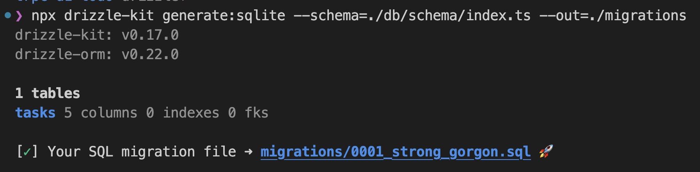
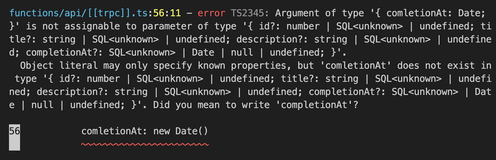

# Modify table schema

The [tasks](../db//schema/tasks.ts) table has the following four columns

- id
- title
- description
- completion_at

In this tutorial, demonstrating how to add columns to the table with [Drizzle](https://github.com/drizzle-team/drizzle-orm).

# Add a label column to tasks table

1. Open `db/schema/tasks.ts` and add a label field.

   ```ts
   import { integer, sqliteTable, text } from "drizzle-orm/sqlite-core";

   export const tasks = sqliteTable("tasks", {
     id: integer("id").primaryKey(),
     title: text("title").notNull(),
     description: text("description").notNull(),
     comletionAt: integer("completion_at", { mode: "timestamp" }),
     label: text("label"), // ← Add this line
   });
   ```

1. Generate a migration with `Drizzle Kit`

   To generate a migration using `Drizzle Kit`, run the `drizzle-kit generate:sqlite` command since Cloudflare D1 uses SQLite. Be sure to specify the path to your schema with the `--schema` option as it's located at `./db/schema/index.ts`.

   Additionally, the Cloudflare D1 migration tool requires migration files to be stored in `./migrations/`. Therefore, set the output path using the `--out` option to ensure that the generated migration files are saved in the correct folder.

   Here's the command you should run:

   ```bash
   npx drizzle-kit generate:sqlite --schema=./db/schema/index.ts --out=./migrations
   ```

   After running the command, you should see the following:

   

   And migration file is the following:

   ```bash
   cat migrations/0001_strong_gorgon.sql
   ALTER TABLE tasks ADD `label` text;
   ```

1. Run a migration with Wrangler

   First, Check the list of unapplied migrations:

   ```bash
   npx wrangler d1 migrations list <DATABASE_NAME> --local
   ```

   Then, you should see the following output:

   ```bash
   Migrations to be applied:
   ┌────────────────────────┐
   │ Name                   │
   ├────────────────────────┤
   │ 0001_strong_gorgon.sql │
   └────────────────────────┘
   ```

   Apply migration:

   ```bash
   npx wrangler d1 migrations apply <DATABASE_NAME> --local
   ```

   > **Note**
   >
   > If you don't know the above commands, you should read [README.md](../README.md) first to know them.

   > **Note**
   >
   > Although Drizzle provides a [migrate API](https://github.com/drizzle-team/drizzle-orm/blob/main/drizzle-orm/src/sqlite-core/README.md#-migrations) for SQLite, it's not always straightforward to use with Cloudflare D1. This is because Cloudflare D1 is only accessible on a Cloudflare Worker, which makes it a little more complicated to set up and use the migrate API.

1. Add a field for the label

Open `src/pages/NewTask.tsx`, and

<!--
There is a typo in a `tasks` table column:

```ts
// db/schema/tasks.ts

import { integer, sqliteTable, text } from 'drizzle-orm/sqlite-core';

export const tasks = sqliteTable('tasks', {
  id: integer('id').primaryKey(),
  title: text('title').notNull(),
  description: text('description').notNull(),
  comletionAt: integer('completion_at', { mode: 'timestamp' })
  ^^^^^^^^^ I misspelled "completion"
});
```

First, fix above typo. Open `db/schema/tasks.ts` and fix it.

```ts
// db/schema/tasks.ts

import { integer, sqliteTable, text } from 'drizzle-orm/sqlite-core';

export const tasks = sqliteTable('tasks', {
  id: integer('id').primaryKey(),
  title: text('title').notNull(),
  description: text('description').notNull(),
  completionAt: integer('completion_at', { mode: 'timestamp' })
});
```

> **Note**
>
> Now, a TypeScript error appears:
>
> 
>
> It's the power of Drizzle! We could find an error before deploy. Let's fix it.
 -->
