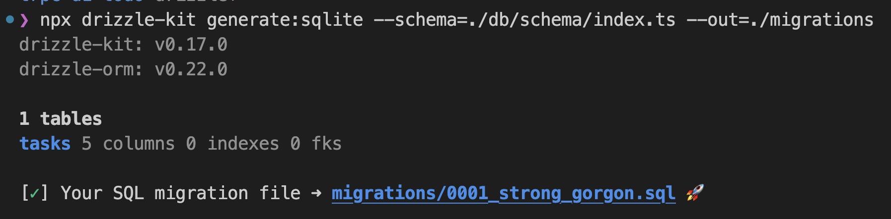
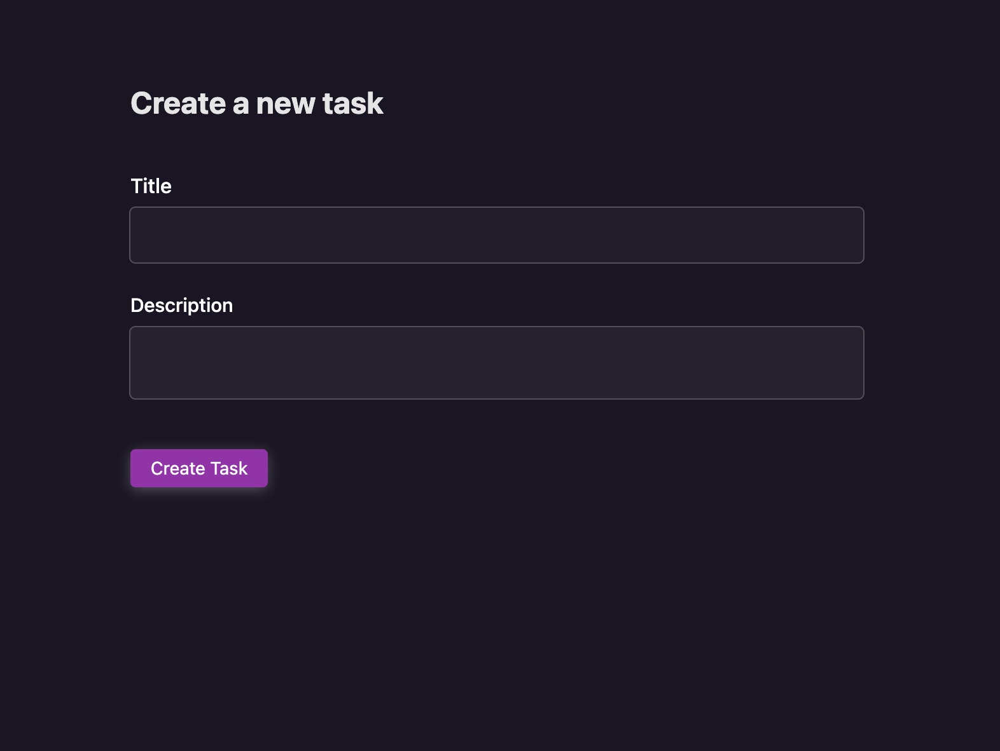
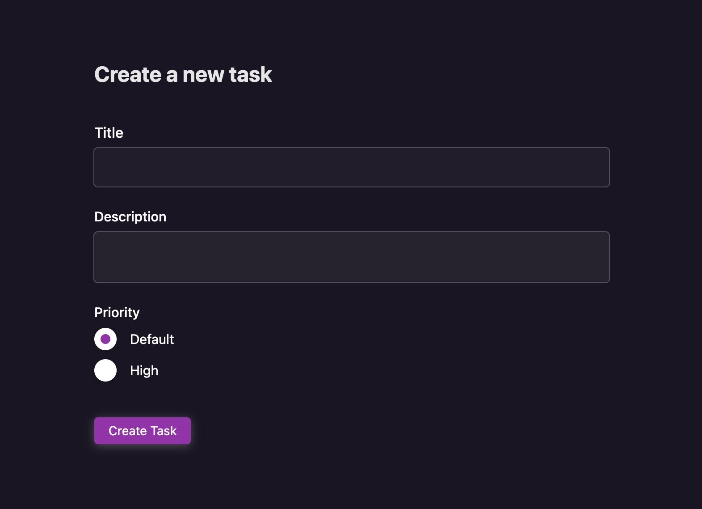
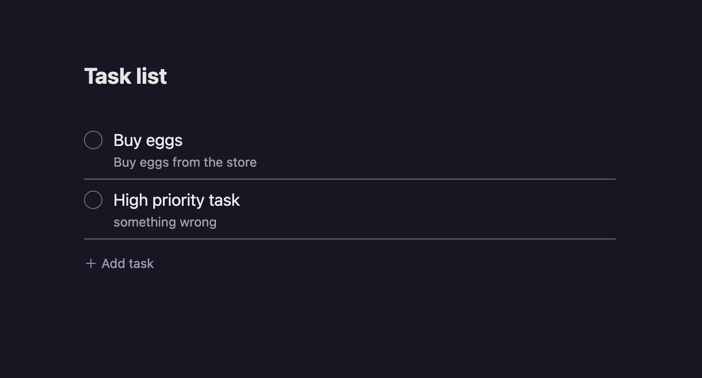
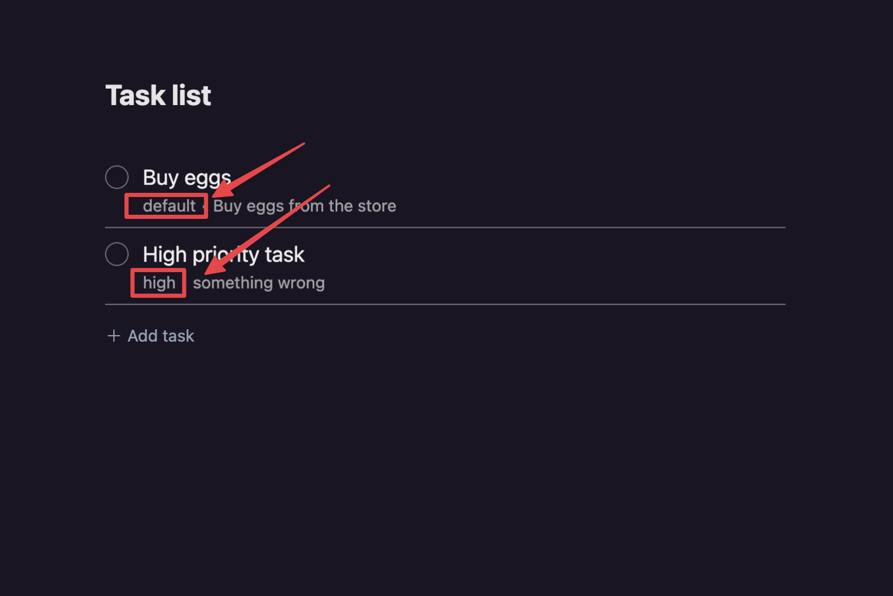
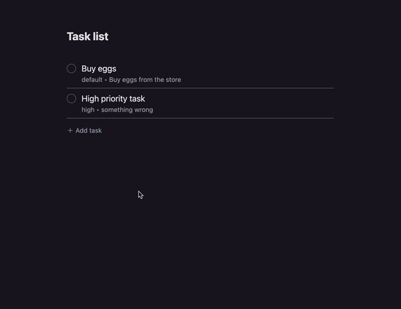
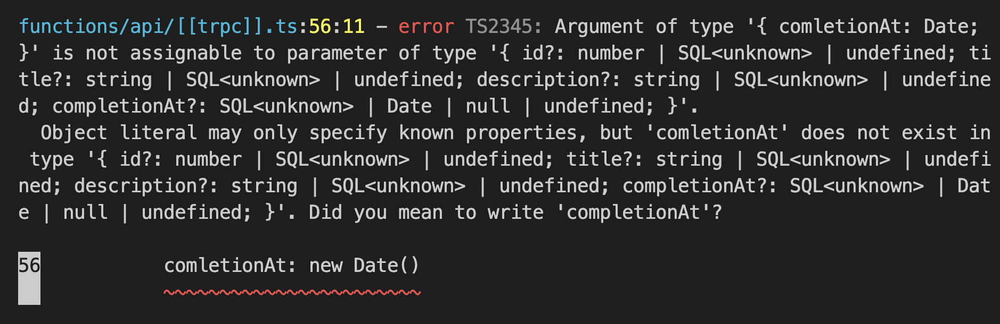

# Tutorial on changing table schema

The [tasks](../db//schema/tasks.ts) table has the following four columns

- id
- title
- description
- completion_at

In this tutorial, demonstrating how to add columns to the table with [Drizzle](https://github.com/drizzle-team/drizzle-orm).

# Add a priority column to tasks table

1. Open `db/schema/tasks.ts` and add a priority field.

   ```ts
   import { integer, sqliteTable, text } from 'drizzle-orm/sqlite-core'

   export const tasks = sqliteTable('tasks', {
     id: integer('id').primaryKey(),
     title: text('title').notNull(),
     description: text('description').notNull(),
     comletionAt: integer('completion_at', { mode: 'timestamp' }),
     priority: text('number').notNull().default('0'), // ← Add this line
   })
   ```

1. Generate a migration with `Drizzle Kit`

   To generate a migration using `Drizzle Kit`, run the `drizzle-kit generate:sqlite` command since Cloudflare D1 uses SQLite. Be sure to specify the path to your schema with the `--schema` option as it's located at `./db/schema/index.ts`.

   Additionally, the Cloudflare D1 migration tool requires migration files to be stored in `./migrations/`. Therefore, set the output path using the `--out` option to ensure that the generated migration files are saved in the correct folder.

   Here's the command you should run:

   ```bash
   npx drizzle-kit generate:sqlite --schema=./db/schema/index.ts --out=./migrations
   ```

   After running the command, you should see the following:

   

   And migration file is the following:

   ```bash
   cat migrations/0001_strong_gorgon.sql
   ALTER TABLE tasks ADD `priority` integer DEFAULT 0 NOT NULL;
   ```

1. Run a migration with Wrangler

   First, Check the list of unapplied migrations:

   ```bash
   npx wrangler d1 migrations list <DATABASE_NAME> --local
   ```

   > **Note**
   >
   > If you don't know the above command, you should read [README.md](../README.md) first to know them.

   Then, you should see the following output:

   ```bash
   Migrations to be applied:
   ┌────────────────────────┐
   │ Name                   │
   ├────────────────────────┤
   │ 0001_strong_gorgon.sql │
   └────────────────────────┘
   ```

   Apply migration:

   ```bash
   npx wrangler d1 migrations apply <DATABASE_NAME> --local
   ```

   > **Note**
   >
   > Although Drizzle provides a [migrate API](https://github.com/drizzle-team/drizzle-orm/blob/main/drizzle-orm/src/sqlite-core/README.md#-migrations) for SQLite, it's not always straightforward to use with Cloudflare D1. This is because Cloudflare D1 is only accessible on a Cloudflare Worker, which makes it a little more complicated to set up and use the migrate API.

1. Update API

   ## Add a priority to the input schema

   Copy the following code, open `functions/api/[[trpc]].ts`, and paste it.

   <details>

   <summary>Show code</summary>

   ```tsx
   import { tasks } from '../../db/schema'
   import { inferAsyncReturnType, initTRPC } from '@trpc/server'
   import tRPCPagesPluginFunction, {
     FetchCreateContextWithCloudflareEnvFnOptions,
   } from 'cloudflare-pages-plugin-trpc'
   import { drizzle } from 'drizzle-orm/d1'
   import { eq } from 'drizzle-orm/expressions'
   import { z } from 'zod'

   // Declare d1 binding as interface
   // Key is same as d1_databases.binding on wrangler.toml
   interface Env {
     DB: D1Database
   }

   // Map binding to context of tRPC
   const createContext = async ({
     env,
   }: FetchCreateContextWithCloudflareEnvFnOptions<Env>) => ({
     db: drizzle(env.DB),
   })

   // Alias context type
   type Context = inferAsyncReturnType<typeof createContext>

   // Create a router instance with context
   const t = initTRPC.context<Context>().create()

   // Create routing to manage tasks
   // It provides three routes:
   //
   //   - create: Create a task
   //   - complete: Complete a task
   //   - list: Retrieve tasks not completed
   const appRouter = t.router({
     tasks: t.router({
       // Route to create a task
       create: t.procedure
         .input(
           z.object({
             title: z.string(),
             description: z.string(),
             priority: z.number(),
           })
         )
         .mutation(async ({ input, ctx }) => {
           await ctx.db
             .insert(tasks)
             .values({
               title: input.title,
               description: input.description,
               priority: input.priority,
             })
             .run()
         }),
       // Route to complete a task
       complete: t.procedure
         .input(z.object({ id: z.number() }))
         .mutation(async ({ input, ctx }) => {
           const result = await ctx.db
             .update(tasks)
             .set({
               comletionAt: new Date(),
             })
             .where(eq(tasks.id, input.id))
             .run()
           if (!result.success) {
             throw new Error(result.error)
           }
         }),
       // Route to retrieve tasks not completed
       list: t.procedure.query(async ({ ctx }) => {
         const result = await ctx.db.select().from(tasks).all()
         return { tasks: result }
       }),
     }),
   })

   // Expose type alias of appRouter. It uses on the client
   export type AppRouter = typeof appRouter

   // Expose a request handler to run it on Cloudflare Pages Functions
   // with tRPCPagesPlugin
   export const onRequest: PagesFunction = tRPCPagesPluginFunction({
     router: appRouter,
     createContext,
     endpoint: '/api/trpc',
     onError: (error) => {
       console.log(error)
     },
   })
   ```

   </details>

1. Update UI

   ## Add a priority field to the task registration form

   Currently, the task registration form has a title and description field. Add a priority field and set its value to the payload of mutation.

   | Current                                     | After                                    |
   | ------------------------------------------- | ---------------------------------------- |
   |  |  |

   Copy the following code, open `src/pages/NewTask.tsx`, and paste it.

   <details>

   <summary>Show code</summary>

   ```tsx
   import { Loader } from '../components/Loader'
   import { useToast } from '../components/Toast'
   import { trpc } from '../utils/trpc'
   import * as Form from '@radix-ui/react-form'
   import * as RadioGroup from '@radix-ui/react-radio-group'
   import { useRouter } from '@raula/router'
   import { useQueryClient } from '@tanstack/react-query'
   import { getQueryKey } from '@trpc/react-query'
   import { FormEvent, useCallback } from 'react'

   export const NewTaskPage = (): JSX.Element => {
     const toast = useToast()
     const { router } = useRouter()
     const createTask = trpc.tasks.create.useMutation()
     const queryClient = useQueryClient()
     const handleSubmit = useCallback(
       async (event: FormEvent<HTMLFormElement>) => {
         event.preventDefault()
         const data = Object.fromEntries(new FormData(event.currentTarget))
         await createTask.mutateAsync({
           title: data.title as string,
           description: data.description as string,
           priority: parseInt(data.priority as string),
         })
         await queryClient.invalidateQueries(getQueryKey(trpc.tasks))

         toast('Create successfully!')
         router.push('/')
       },
       [router, toast, createTask, queryClient]
     )
     return (
       <main>
         <h1 className="text-2xl text-neutral-200 font-bold mb-8">
           Create a new task
         </h1>
         <Form.Root className="space-y-10" onSubmit={handleSubmit}>
           <div className="space-y-4">
             <Form.Field className="grid" name="title">
               <div className="flex items-baseline justify-between">
                 <Form.Label className="font-medium leading-[35px] text-mauve1">
                   Title
                 </Form.Label>
                 <Form.Message
                   className="text-sm text-mauve1 opacity-[0.8]"
                   match="valueMissing"
                 >
                   Please enter a title
                 </Form.Message>
               </div>
               <Form.Control asChild>
                 <input
                   className="box-border w-full bg-whiteA3 shadow-whiteA8 hover:shadow-whiteA9 focus:shadow-whiteA11 inline-flex py-3 appearance-none items-center justify-center rounded px-3 leading-none text-mauve1 shadow-[0_0_0_1px] outline-none selection:color-white selection:bg-blackA9"
                   type="text"
                   required
                 />
               </Form.Control>
             </Form.Field>
             <Form.Field className="grid" name="description">
               <div className="flex items-baseline justify-between">
                 <Form.Label className="text-[15px] font-medium leading-[35px] text-mauve1">
                   Description
                 </Form.Label>
                 <Form.Message
                   className="text-[13px] text-mauve1 opacity-[0.8]"
                   match="valueMissing"
                 >
                   Please enter a description
                 </Form.Message>
               </div>
               <Form.Control asChild>
                 <textarea
                   className="box-border w-full bg-whiteA4 shadow-whiteA8 hover:shadow-whiteA9 focus:shadow-whiteA11  inline-flex py-3 appearance-none items-center justify-center rounded px-3 leading-none text-mauve1 shadow-[0_0_0_1px] outline-none selection:color-white selection:bg-blackA9 resize-none"
                   required
                 />
               </Form.Control>
             </Form.Field>
             <Form.Field className="grid" name="priority">
               <div className="flex items-baseline justify-between">
                 <Form.Label className="text-[15px] font-medium leading-[35px] text-mauve1">
                   Priority
                 </Form.Label>
                 <Form.Message
                   className="text-[13px] text-mauve1 opacity-[0.8]"
                   match="valueMissing"
                 >
                   Please select a priority
                 </Form.Message>
               </div>
               <Form.Control asChild>
                 <RadioGroup.Root
                   className="flex flex-col gap-2.5"
                   defaultValue="0"
                   aria-label="View density"
                 >
                   <div className="flex items-center">
                     <RadioGroup.Item
                       className="bg-white w-[25px] h-[25px] rounded-full shadow-[0_2px_10px] shadow-blackA7 hover:bg-plum3 focus:shadow-[0_0_0_2px] focus:shadow-black outline-none cursor-default"
                       value="0"
                       id="r1"
                     >
                       <RadioGroup.Indicator className="flex items-center justify-center w-full h-full relative after:content-[''] after:block after:w-[11px] after:h-[11px] after:rounded-[50%] after:bg-plum11" />
                     </RadioGroup.Item>
                     <label
                       className="text-white text-[15px] leading-none pl-[15px]"
                       htmlFor="r1"
                     >
                       Default
                     </label>
                   </div>
                   <div className="flex items-center">
                     <RadioGroup.Item
                       className="bg-white w-[25px] h-[25px] rounded-full shadow-[0_2px_10px] shadow-blackA7 hover:bg-plum3 focus:shadow-[0_0_0_2px] focus:shadow-black outline-none cursor-default"
                       value="1"
                       id="r2"
                     >
                       <RadioGroup.Indicator className="flex items-center justify-center w-full h-full relative after:content-[''] after:block after:w-[11px] after:h-[11px] after:rounded-[50%] after:bg-plum11" />
                     </RadioGroup.Item>
                     <label
                       className="text-white text-[15px] leading-none pl-[15px]"
                       htmlFor="r2"
                     >
                       High
                     </label>
                   </div>
                 </RadioGroup.Root>
               </Form.Control>
             </Form.Field>
           </div>
           <Form.Submit asChild>
             <button
               className="box-border text-white justify-center rounded bg-plum11 hover:bg-plum10 leading-none py-2 px-4 text-sm shadow-[0_2px_10px] shadow-whiteA8 flex items-center disabled:cursor-not-allowed disabled:opacity-50"
               disabled={createTask.isLoading}
             >
               {createTask.isLoading && <Loader />}
               Create Task
             </button>
           </Form.Submit>
         </Form.Root>
       </main>
     )
   }
   ```

   </details>

   ## Show the icon on a high-priority task

   | Current                                          | After                                         |
   | ------------------------------------------------ | --------------------------------------------- |
   |  |  |

   Copy the following code, open `src/components/Task.tsx` and paste it.

   <details>

   <summary>Show code</summary>

   ```tsx
   import { Task as TaskSchema } from '../../db/schema'
   import * as Checkbox from '@radix-ui/react-checkbox'
   import { CheckIcon } from '@radix-ui/react-icons'

   type Props = Pick<TaskSchema, 'title' | 'description' | 'priority'> & {
     onClick: () => void
   }
   export const Task = ({
     title,
     description,
     priority,
     onClick,
   }: Props): JSX.Element => {
     return (
       <label className="flex space-x-3 cursor-pointer py-2">
         <Checkbox.Root
           className="flex h-5 w-5 appearance-none items-center justify-center rounded-full outline-none border border-whiteA9 shadow-sm text-transparent hover:text-slate-400 mt-1"
           checked
           onCheckedChange={() => onClick()}
         >
           <Checkbox.Indicator className="text-inherit">
             <CheckIcon />
           </Checkbox.Indicator>
         </Checkbox.Root>
         <div>
           <h2 className="text-lg text-whiteA12">{title}</h2>
           <ul className="text-sm text-whiteA11 flex space-x-1">
             <li>
               {priority === 0 && <p>default</p>}
               {priority === 1 && <p>high</p>}
             </li>
             <li>
               <p>•</p>
             </li>
             <li>
               <p>{description}</p>
             </li>
           </ul>
         </div>
       </label>
     )
   }
   ```

   </details>

## Run locally

Start development server on:

```bash
npx wrangler pages dev --local --persist --d1=<DATABASE_BINDING> -- npm run dev
```

Once you open your browser, you should be able to create a task with priority:



## Deploy to Cloudflare Pages

1. Push your repository to GitHub

   > **Note**
   >
   > If you haven't deployed to Cloudflare yet, you should read [README.md](../README.md) first and try to deploy to Cloudflare

1. Apply a migration to Cloudflare D1

   First, Check the list of unapplied migrations:

   ```bash
   npx wrangler d1 migrations list <DATABASE_NAME>
   ```

   Then, you should see the following output:

   ```bash
   Migrations to be applied:
   ┌────────────────────────┐
   │ Name                   │
   ├────────────────────────┤
   │ 0001_strong_gorgon.sql │
   └────────────────────────┘
   ```

   Apply migration:

   ```bash
   npx wrangler d1 migrations apply <DATABASE_NAME>
   ```

<!--
There is a typo in a `tasks` table column:

```ts
// db/schema/tasks.ts

import { integer, sqliteTable, text } from 'drizzle-orm/sqlite-core';

export const tasks = sqliteTable('tasks', {
  id: integer('id').primaryKey(),
  title: text('title').notNull(),
  description: text('description').notNull(),
  comletionAt: integer('completion_at', { mode: 'timestamp' })
  ^^^^^^^^^ I misspelled "completion"
});
```

First, fix above typo. Open `db/schema/tasks.ts` and fix it.

```ts
// db/schema/tasks.ts

import { integer, sqliteTable, text } from 'drizzle-orm/sqlite-core';

export const tasks = sqliteTable('tasks', {
  id: integer('id').primaryKey(),
  title: text('title').notNull(),
  description: text('description').notNull(),
  completionAt: integer('completion_at', { mode: 'timestamp' })
});
```

> **Note**
>
> Now, a TypeScript error appears:
>
> 
>
> It's the power of Drizzle! We could find an error before deploy. Let's fix it.
 -->
